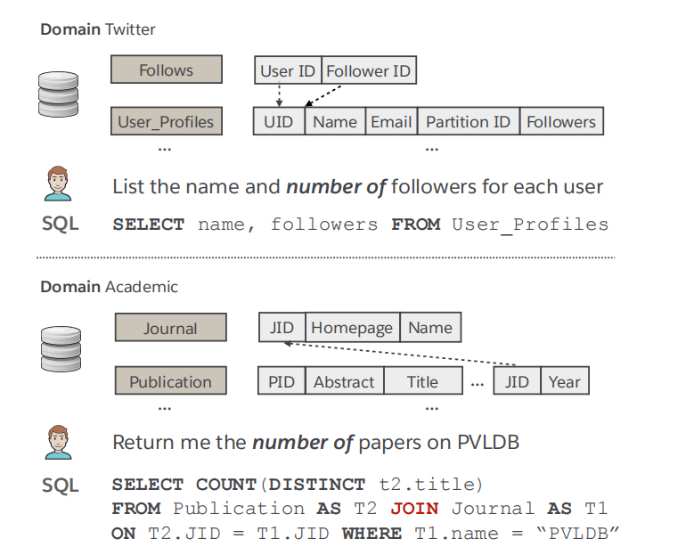
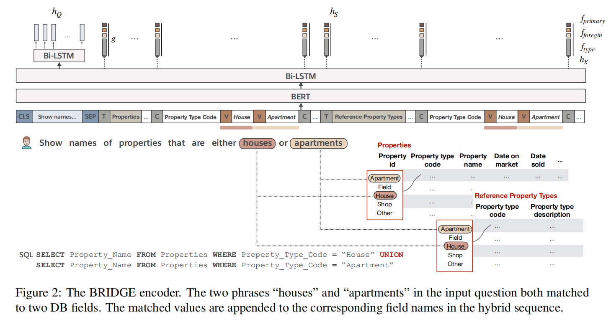
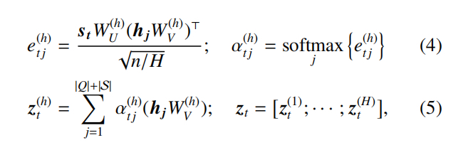
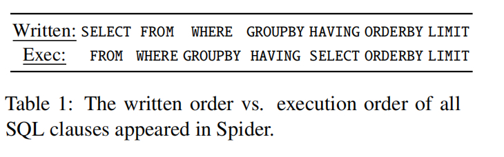
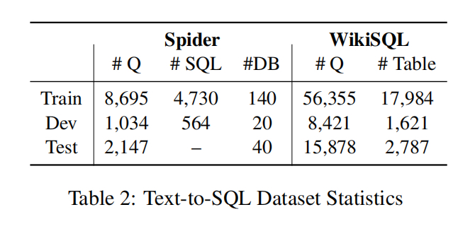
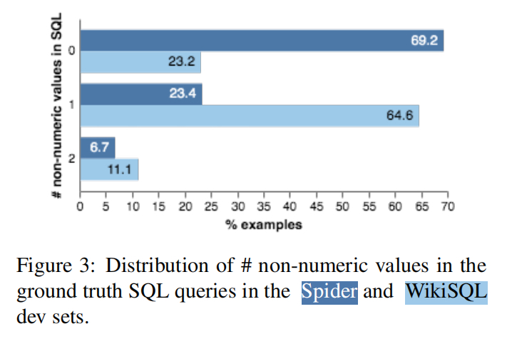
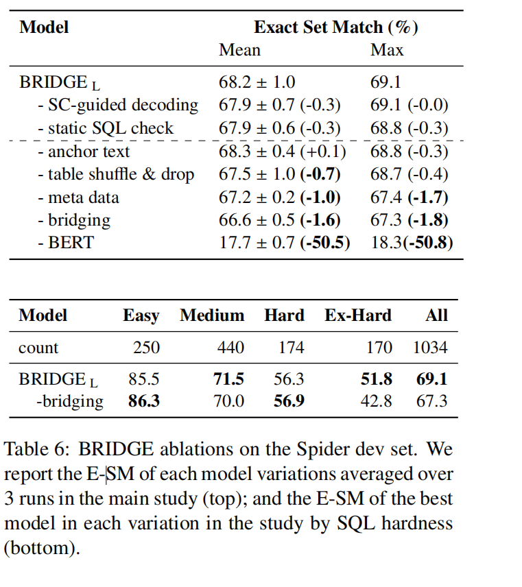
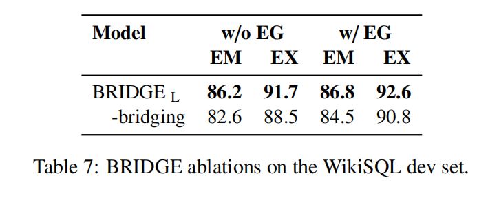

# Bridging Textual and Tabular Data for Cross-Domain Text-to-SQL Semantic Parsing

## Pass1

### 摘要

提出BRIDGE: 自然语言和关系型之间的跨数据库语义解析的序列架构。
问题和DB结构放到一个打标序列中，其中字段中的一些子集被问题中的cell value增强。

混合序列通过带有最小后续层 (minimal subsequent layers)的BERT编码，text-DB场景通过BERT中的deep attention 的微调实现。

联合使用了模式一致性（schema-consistency）来驱动搜索空间裁剪的```pointer generator```编码器, BRIDGE在主流的跨库text-to-sql性能测试中达到了SOTA性能（spider和WikiSQL）

### 结论

部分摘要内容。

劣势：
泛化困难，可能犯无法解释的错误。

在数据充足且逻辑形式不复杂的情况下，seq-to-seq模型对于跨库语义解析是一个好的选择。

为了解决通用text-to-sql问题以及应用到生产环境，我们需要进一步提升组合组合泛化性（[compositional generalization](#compositional_generalization)）和提升模型可解释性。

其它方向(文本或者表格理解类任务): 弱监督(weakly supervised)语义解析和事实核实。

### 实验和方法图表

1. 能处理微博或者专业类查询
2. bert处理然后到Bi-LSTM再处理
3. spider数据集取得了很好的效果；一起对比的有不少GNN的算法；不少算法都结合了BERT一起使用。
4. WikiSQL效果拔群
5. 做了消融实验，证明没BERT不行
6. 统计了错误分类和数量(逻辑错误最多)

## Pass2

### 1. Introduction

之前的工作专注在单DB上。



图1说明了虽然都是求数量函数，但是由于表结构不同，相应的查询SQL却差异很大。所以跨DB的text-to-sql不能只是简单记住SQL模式，而是要精准地对自然语言问题、目标表结构以及两者的语境化建模。

设计原则：

1. 问题和模式表示要互相语境化
2. 预训练的语言模型(LMs)，通过增强对自然语言变化的泛化和捕获长期依赖关系，可以显着提高解析精度
3. 在数据隐私允许范围内，利用DB内容可以提升对DB结构的理解（图1的第二个例子，字段中的值"PLVDB"帮助模型生成了where条件。

BRIDGE：融合了上述三个设计原则，将DB结构表示成打好标的句子连接到问题中。之前工作提出了用于建模DB的任务特定层（task-specific layers），Bridge使用BERT编码打好标句子并轻量化剩下的层-两个单层双向LSTM。

每一个结构的组件（表或者字段）使用隐藏层状态简单表示，这与其在混合句子中的特殊的token相一致。

BRIDGE在混合句子中添加锚文本（anthor texts)(从问题中提到的DB cell values中自动解析出)。在混合序列文本中，anthor texts被附加（append）到它对应的字段后(图[2](#f2)), 通过在重叠词汇中微调BERT注意力来隐式实现text-DB对齐。

结合Pointer-generator与模式约束驱动搜索空间裁剪(schema-consistency driven search space pruning)，BRIDGE在Spider和WikiSQL数据集达到了SOTA，比近年提出的使用特定任务架构(task-specific architectures)的模型。

在概括自然语言多样性和记住结构化的模式高效, 但是还是缺乏泛化性和可解释性。

我们推断在跨域(cross-domain)text-to-sql依然有很多未解决的挑战


<div id="f2"/>

### 2 模型

#### 2.1 问题定义

给定义一个自然语言问题$Q$和模式$S = \langle \tau, C \rangle$, 对于一个关系型数据库，需要生成对应的查询SQL $Y$。
模式由表 $\tau = \{t_1, ..., t_N\}$ 和字段 $C = \{c_{11}, ..., c_{1|T_1|}, ..., c_{n1},..., c_{n|T_N|}\}$, 每一个表$t_i$和每一个字段$c_{ij}$都有一个文本名称。有些字段是主键、外键，另外，每个字段都有数据类型$τ \in \{\text{number, text, time, boolean等}\} $

大部分现有的解决方案都没有考虑数据库内容，最近的一些方法表明数据库内容对于性能有显著作用。我们采用一篇研究的设置：采用字段数据一些集合而不是所有的数据。
例如，图2中采用{“Apartment”, “Field”, “House”, “Shop”, “Other”}等数据(猜测主要跟问题Q相关，GPT有类似的思想)，这些值的集合被称为挑选名单(picklists)，这个设定将会保护一些敏感的数据。

#### 2.2 问题模式序列化和编码

使用被一堆字段尾随的表名标识每一个表，每个表名的前面有一个特殊的token
```[T]```，每个字段名前有一个token```[C]```，多个表的被连在一起，表示为序列化的模式(serialization of the schema)，它被两个```[SEP]```包裹，连接到问题上，最终变成BERT的格式：

$$
X = [CLS],Q,[SEP],[T],t_1,[C],c_{11}...,c_{1|T_1|},[T],t_2,[C],c_{21},...,[C],c_{N|T_N|}, [SEP]
$$

$X$被BERT编码，然后是一个Bi-LSTM，形成**基础编码**(base encoding)$\pmb h_X \in \mathbb R^{|X| \times n}$。 $\pmb h_x$的问题段(Question segment)又通过另一个Bi-LSTM获得问题编码$\pmb h_Q \in \mathbb R^{|Q| \times n}$

每个表/字段都使用与其特殊标记 [T]/[C] 对应的 $\pmb h_x$ 切片表示。

**元数据特征(Meta-data Features)**
训练全连接(dense)去发现表结构元数据特征。包含：

- 字段是否是主键($\pmb f_{pri} \in \mathbb R^{2 \times n}$)
- 是否是外键($\pmb f_{for} ∈ \mathbb R^{2 \times n}$)
- 字段数据类型($\pmb f_{type} = \mathbb R^{|τ|\times n}$)

元数据特征通过前馈网络层$g(\mathbb R^{4n} \rightarrow \mathbb R^n)$融合了模式组件的基础编码(base encoding)，以得到如下编码输出:
$$
\begin{equation*}
  \begin{aligned}
    \pmb h_S^{t_i} &= g([\pmb h_X^p; \pmb 0; \pmb 0; \pmb 0]) \\
    \pmb h_S^{c_{ij}} &= g([\pmb h_X^q; \pmb f_{pri}^u; \pmb f_{for}^v; \pmb f_{type}^w]) \\
    &= \text{ReLU}(\pmb W_g [\pmb h_X^m; \pmb h_{pri}^u; \pmb h_{for}^v; \pmb f_{type}^w] + \pmb b_g) \\
    \pmb h_S &= [\pmb h^{t_1}, ..., \pmb h^{t_{|\tau|}}, \pmb h^{c_{11}}, ..., \pmb h^{c_{N|T_N|}}] \in \mathbb R^{|S| \times n}
  \end{aligned}
\end{equation*}
$$
其中$p$是与表$t_i$关联的```[T]```在$X$中的下标，$q$是字段$c_{ij}$与之关联的```[C]```在$X$中的下标。$u, v$和$w$是字段$c_{ij}$属性的特征索引。
$[\pmb h_X^m; \pmb h_{pri}^u; \pmb h_{for}^v; \pmb f_{type}^w] \in \mathbb R^{4n}$是连接在一起的四个向量。 特定字段的元数据特征和表的表示都与占位符$\pmb 0$向量融合。

#### 2.3 Bridging

光对字段和表名建模还不够，添加了描文本(anchor text)来链接问题中提到的值和其对应的DB字段。对问题$Q$和数据库每个字段中的挑选名单(picklist)。匹配上的字段值(anthor text)被插入到问题模式表示X中（在对应的字段名称之后，并用```[V]```分割), 如果多个匹配则按匹配顺序连起来。将所有匹配的都加进去，让模型学习解决歧义。

#### 2.4 Decoder

使用基于LSTM带有多头注意力的[pointer-generator](#pointer_generator)作为解码器。

解码器使用问题编码器的终态初始化, 每一步: 从词汇表$\nu$中生成一个token，从问题$Q$中复制一个token或者从$S$中复制一个模式组件(schema component)。

学术一点, 对于每一步$t$, 给解码器一个状态 $\pmb s_t$和编码器的表示$[\pmb h_Q; \pmb h_S] \in \mathbb R^{(|Q| \times |S|)\times n}$, 计算多头注意力：


其中$h$是头的编号，而$H$是头的数量。

从词典$\nu$中生成词的概率和输出概率分布为:
$$
p_{gen}^t = sigmoid(\pmb s_t \pmb W_{gen}^s + z_t\pmb W_{gen}^z + \pmb b_{gen}) \tag 6
$$
$$
p_{out}^t = p_{gen}^t \pmb P_{\nu}(y_t) + (1 - p_{gen}^t)\sum_{j: \tilde{X}_j = y_t} \alpha_{tj}^{(H)} \tag 7
$$

这里的$P_{\nu}(y_t)$是LSTM 的softmax输出的概率分布，$\tilde{X}$是（$|Q| + |S|$）序列的长度，该序列只包含X中的问题词和特殊token ```[T]```和```[C]```。
我们使用最后一个头的注意力权重来计算```Pointing distribution```（实践证明比只使用单头或者多头做平均汇聚效果更好）

给LSTM解码器的输入状态中使用了[selective read](#selective_read)技术。

#### 2.5 Schema-Consistency Guided Decoding

基于SQL语法做搜索空间裁剪: 出现在每个SQL中的字段只来源于```from```的表中。

**按执行顺序生成SQL字句**

将训练集中每个SQL子句重排为标准的SQL执行顺序，见表1。例如：```SELECT COUNT(*) FROM Properties```转为```FROM Properties
SELECT COUNT(*)```



我们提出一个带有子句的查询SQL的执行顺序满足以下引理：
**引理1**:
*如果$Y_{exec}$是一个带有子句的被按照执行顺序组织起来的SQL，那么SQL中任何表的字段都必须出现在表的后面*.
因此我们使用一个二元注意力掩码(binary attention mask $\xi$):
$$
\tilde{\alpha}_t^{(H)} = \alpha_t^{(H)} \cdot \xi
$$

刚开始所有字段对应的部分都设置为$0$，一旦一个表$t_i$被解码，我们将$\xi$中对应于$\{c_{i1},...,c_{i|T_i|} \}$的部分设置为$1$。这使得编码器以比较低的开销只搜索引理1中情况的空间。
**引理2: token变换(Token Transition)**
*如果$Y$是一个合法的SQL，那么Y中任何的表/字段的token只能出现在SQL保留字(reserved token)后；Y中的任何值(value)token只能出现在SQL的保留字或者值token后*

在每个解码阶段，我们使用这个启发式的算法裁剪候选token。这使用词掩码（vocabulary masking）实现。

### 3 相关工作

#### Text-to-SQL Semantic Parsing

现有模型在单表或者简单查询SQL上已经超越了人类，但是多库和复杂SQL查询上还有很大的提升空间。

（论文1，2，3）提出的将关系型DB结构作为图然后使用图结构指导编码。
（论文xx-2019）提出模式连接(schema-linking)和SemSQL，这是一种特定问题的中间SQL表示，通过一个基于树的编码器。
（论文xx-2019）提出RAT-SQL，一个能有效覆盖结构图的关系和与问题的关联的统一的图编码机制。它的整体架构非常深，在BERT-large上，由8个关系自注意力层组成。作为对比，BRIDGE使用BERT和最小后续层组成，使用了带有空间搜索裁剪启发式算法和少量SQL层抽象的序列解码器。

#### Seq2Seq Models for Text-to-SQL Semantic Parsing

许多工作使用seq2seq模型解析语法解析问题，将它视为一个翻译问题。

通常连接问题与DB的结构信息（如果是单表，则只用表头）

（论文xx2017）第一次应用这种表示到WikiSQL中。
（论文xx2019）第一次证明了使用Bert能在WikiSQL数据集取得很好的效果。我们的工作展示了使用Bert编码的句子表示也能在多表查询等复杂场景取得很好的效果。
同时，（论文xx2020）在spider数据集上使用Bert Transformer模型；（论文xx2020）使用带有3B参数的T5模型在Spider上取得了SOTA性能；然后这俩模型都没有使用DB内容（2022-09注：当前spider排名第3的T5-SR模型已经使用了Db Content)。此外BRIDGE使用小得多的模型也达到了相似的性能。对比T5的12层transformer，BRIDGER解码器只用了单层的LSTM。

#### Text-to-SQL Semantic Parsing with DB Content

（论文xx2018）使用问题-值匹配在wikisql中达到了很高的预测精度。
（论文2019）说明了在跨DB语义解析中，（DB）值的信息至关重要，当然该文章也表示使用Bert扩充GNN编码器起到了反向作用，所有的模型都比SOTA低得多。
（论文2019）使用特征嵌入（ feature embeddings）或关系注意力层（relational attention layers）显示建模模式链接（schema linking）
此外，一些模型通过SQL执行训练模型来利用DB内容或者在推理期间使用执行指导(execution-guided)编码而不是直接利用DB内容作为输入。

#### Joint Representation of Textual-Tabular Data and Pre-training

BRIDGE是一个融合问题、DB结构和相关DB单元数据的通用框架。在要求关联文本型和表格型数据理解上，BRIDGE有潜力应用到更广泛的问题中。
（论文xx-2020）提出TaBERT，一个在百万Web表格中预训练，用于解决联合文本型和表格型表示的语言模型。
（论文xx-2020）提出TaPas，一个对于弱监督的表格QA支持算数操作的预训练text-table语言模型。
TaBERT和TaPas专注以单表。TaBERT通过每个表独立编码，使用层级Attention可以应用到Spider数据集中。



### 4 实验设计

#### 4.1 数据集 

使用Spider和WikiSQL。

#### 4.2 评估指标

使用Spider和WikiSQL作者的指标

**Exact Match (EM)** 预测SQL是否与真实（ground truth）的SQL完全一致，这是一个性能下限：因为语义上正确的SQL可能与真实的SQL形式不同。

**Exact Set Match (E-SM)** 通过检查匹配每个SQL子句的无序集来评估SQL的正确性，这会忽略预测值的错误

**Execution Accuracy (EA)** 检查在目标库是否能执行，并且比对结构是否相同。



#### 4.3 实现细节

**锚文本（Anchor Text）选择** 使用官方数据文件计算每个字段的挑选名单，开发了一个模糊匹配算法，匹配问题中提到的值，且在数据库中存在（细节见附录）

每个字段包含k个匹配项，使用长匹配。排除所有的数字类型的项（比如低于$50的鞋子，直接查询可能是不对的），者无法有效在多个字段间区分的。

如图3，约31%的Spider样本包含一个或者多个非数字，这将从briding机制中受益。WikiSQL中这个比率更高，达到了76.8%。事实正确的SQL中包含非数字项大于2的比例很低，基于此分析，在我们实验中，我们设置$k=2$

**数据修复（Data Repair）**
原始的Spider在样例文件和数据文件中都包含了一些错误。在训练和验证中，我们修复了这些错误。
提交结果时使用了官方的数据。使用了高精度的启发式算法在训练和推理期间修复外键：如果两个表中的两个字段名相同，并且其中一个是主键，我们称他们为外键值对(foreign key pair)

**训练**
使用交叉熵损失（ cross-entropy loss）训练模型，使用带有默认参数和32个小批量的Adam-SGD。
使用Huggingface中的```uncased BERT-large```模型。LSTM均是单层，在编码器和解码器中使用了8个注意力头。

- spider：LSTM隐藏层维度为400，100k步，前5000次迭代中学习率为$5e^{-4}$, 使用```L-inv```函数（附录 [A.5](#A.5) ）缩减到0。在前4000次迭代中BERT微调率(fine-tuning rate)从$3e^{-5}$到$6e^{-5}$，后续根据```L-inv```函数缩减到0。随机排列DB中的表的顺序，每次迭代中，以0.3的概率删除一个没有出现在基本事实中的表。NVIDIA A100大约51.5h。

- WikiSQL: LSTM隐藏层维度为512， 50k步，A100约6小时

**解码（Decoding）**
包含70个SQL关键字和保留字的词汇表，并添加10个数字（"first"，“second” “youngest”等），排行榜评估的[beam size](#beam_search) 为64.

只在推测期间使用模式约束指导解码(consistency guided decoding)

### 5 结果


#### 5.2 消融试验(Ablation Study)

**Spider**


**WikiSQL**


试验证明，对于非数字字段，bridging机制非常有用。

## 名词解释

- <span id="compositional_generalization">组合组合泛化性</span>
理解和产生对于已知成分（known components）组成一个新的组合（novel combinations）的能力称为组合泛化

- <span id="pointer_generator">pointer-generator</span>
- <span id="selective_read">selective read</span>
- <span id="beam_search">[束搜索-beam search](https://blog.csdn.net/u013250861/article/details/113448450), 每次保留的可选项的长度为beam size</span>
## 附录

### A.5