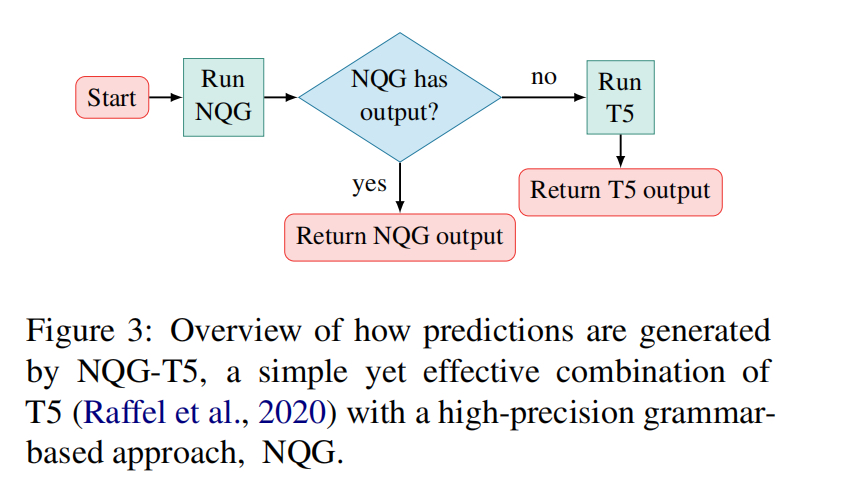
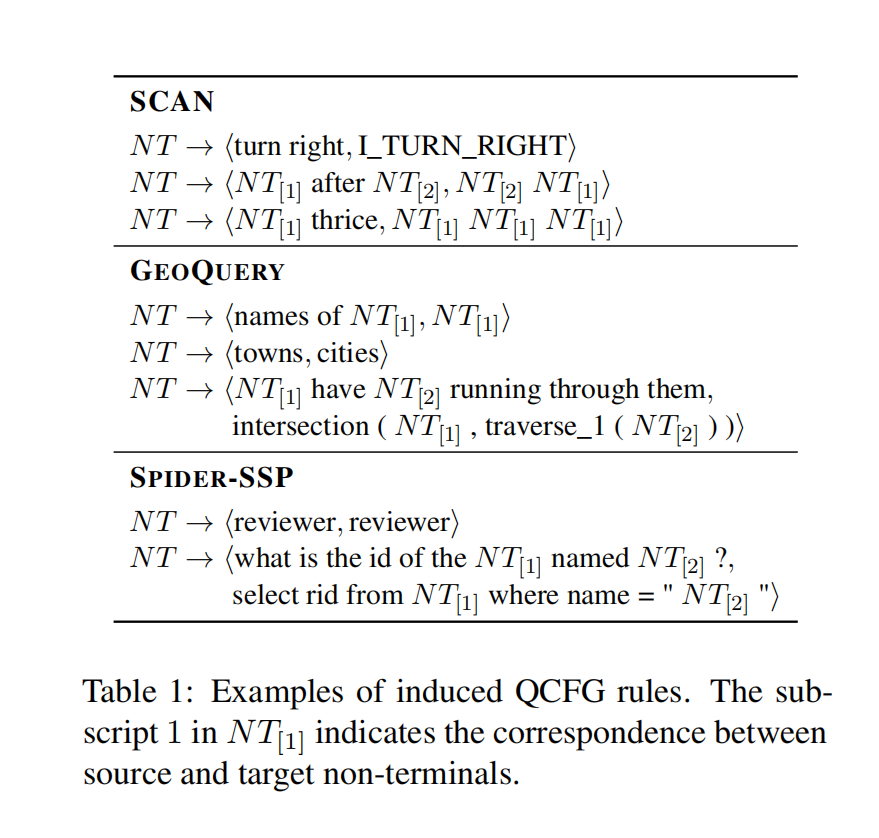

# (Goolge Research)组合泛化和自然语言变体：一种语义解析方法能否处理两者？(Compositional Generalization and Natural Language Variation: Can a Semantic Parsing Approach Handle Both?)

## Pass1

### 摘要

seq2sqe擅长处理自然语言变体的问题，但是已经验证了难以处理分布外的组合泛化问题。

### 结论

证明了T5和NQG在分布外的样例有不错的优势，但是受限于语法的句法约束，需要一些精确的感应规则的词在推理时提供推导。

T5覆盖范围内的不受此类规则约束，但是分布外的样本非常明显。虽然 NQG 缺乏覆盖的分布外示例的准确性仍然有限，我们相信它为未来的工作设定了一个强大而简单的基准。

## Pass2

### 1. Introduction

### 2. Background and Related Work

### 3. Target Maximum Compound Divergence (TMCD) Splits

### 4 提出的方法: NGQ-T5

NQG: 由判别式神经解析模型和灵活的准同步语法归纳算法组成，该算法可以对任意字符串对进行操作(consists of a discriminative **N**eural parsing model and a flexible **Q**uasi-synchronous **G**rammar induction algorithm which can operate over arbitrary pairs of strings)。

给定一个输入，都会给一个输出，如果NQG没有输出，则返回T5的输出。



NQG和T5单独训练，训练数据由源和目标的字符串对组成，命名为$\mathcal{x}$和$\mathcal{y}$。

#### 4.1 NQG组件

训练分两阶段。首先，基于压缩的语法归纳技术来构建我们的语法。
其次，基于归纳语法，通过判别潜变量模型(via a discriminative latent variable model)来构建NQG语法解析模型，通过强大的神经编码器对锚定在输入字符串$x$的语法进行评分。

##### 4.1.1 NQG语法归纳

**语法形式** 使用$QCFGs$作为参考，语法器包含了单个非终结字符(non-terminal symbol), ```NT```。

**归纳过程(Induction Procedure)** 为了从训练数据中归纳$\mathcal{G}$的形式，我们提出了不需要特定任务启发也不需要词预校准计算的QCFG归纳算法。

值得注意的是，除了 QCFG 形式主义中隐含的假设之外，我们的方法没有对源语言或目标语言做出明确的假设。 



我们使用贪心算法来搜索最小化这个代码长度的目标函数的算法。

对于每一个训练样本$(x, y)$, 通过创建一个规则$NT \rightarrow \langle x, y \rangle$ 来初始化$\mathcal{G}$。

当没有能降低目标函数的规则被发现则结束搜索，实际上在每轮迭代中，我们使用了一些近似来选择一个规则。具体细节见附录A.2。

##### 4.1.2 NQG语义解析模型

基于$\mathcal{G}$, 我们潜变量判别解析模型。


##### 4.1.3 NQG Discussion

#### 4.2 T5组件

我们直接在T5上微调。

### 5 实验

#### 5.1 SCAN和GEOQUERY实验

这两个数据集被广泛用来研究组合泛化性和自然语言变体。
