# RASAT: Integrating Relational Structures into Pretrained Seq2Seq Model for Text-to-SQL

## Pass1

### 摘要

模式链接(schema linking)和模式编码(schema encoding)等关系结构(Relational structures)已经被验证了对于提高自然语言到sql查询有用。然而，引入这些结构关系是有代价的：它们通常会导致特殊的模型结构，这在很大程度上禁止在 text-to SQL 中使用大型预训练模型。

故我们提出PASAT: 使用关系感知(relational aware)和自注意力(self-attention)增强的seq2seq架构的transformer模型，它能覆盖复杂的关系结构，与此同时能更好地从t5预训练模型中继承参数。我们的模型能够整合文献中几乎所有类型的现有关系，此外，我们建议为多轮场景引入共指关系。
在单轮(single-turn)或多轮(multi-turn)场景，在Spider和SparC和CoSQL数据集达到了SOTA执行精度(80.5% EX on Spider, 53.1% IEX on SParC, and 37.5% IEX on CoSQL)

### 结论

同摘要。

### 关键方法和试验的图表

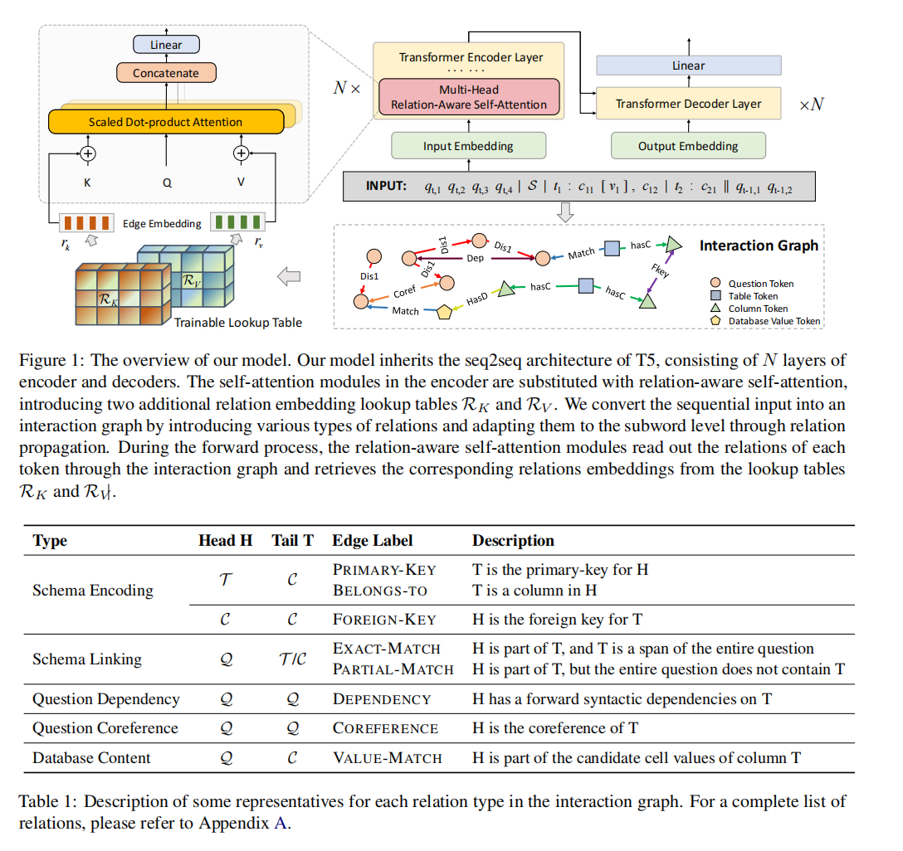

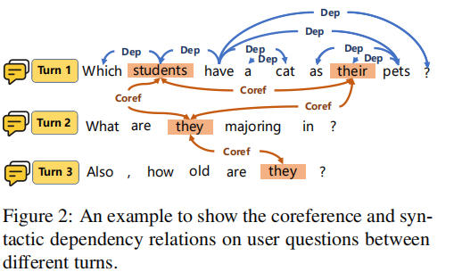


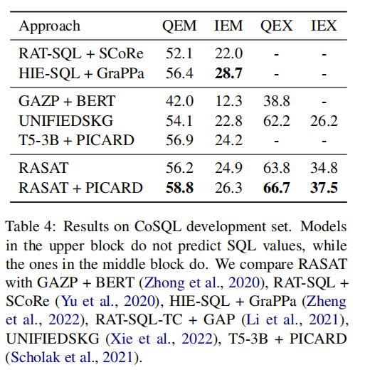

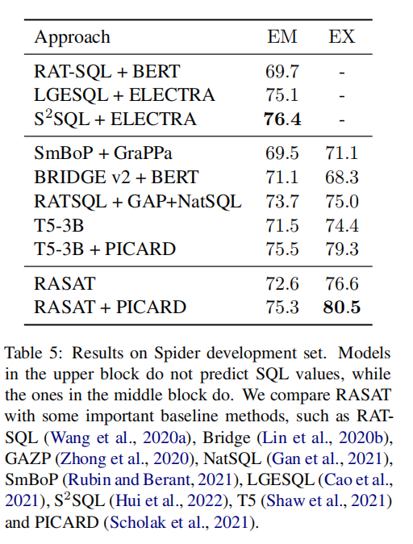

## Pass2

### 1 Introduction

树形decoder对于提升生成SQL的质量以及在没有见过的数据集上有很好的效果，但是各种各样特殊设计的模型明显已经偏离了形式，如果想使用更大的预训练模型在这种任务上很困难。

[论文2029](https://aclanthology.org/2021.acl-long.75/)表明就算不使用任何关系结构，直接在T5模型中微调也能达到令人满意的效果。

PICARD提出了在推理时无效裁剪束搜索结果的方法，极大提升了使用T5自带的自回归编码器生成的SQL的语法正确率。

不同于之前的在原预训练模型上进行微调或者使用提示学习([Prompt Tuning](#prompt_tuning)), 我们提出在编码器中添加自注意力以及给模型添加新参数的同时任然可以利用预训练模型的参数的方法，名为PASAT(Relation-Aware Self-Attention-augmented T5)。

我们的模型包含几乎所有的文献(literature)中的关系, 包含模式编码（schema encoding)， 模式连接(schema linking)，问题句法依赖等。

对于多轮text-to-sql任务，我们引入了共指关系（coreference relations）。

实验表明PASAT能更有效地利用T5的优势，在多轮（SParC和CoSQL）和单轮（Spider）text2sql性能测试中达到了SOTA性能。

在SParC，执行精度（execution accuracy (IEX)）从46.4%到53.1%， 
在CoSQL，从26.2%到37.5%。在Spider，从79.3%到80.5%。

### 2 相关工作

之前的工作大多采用基于草图的槽填充方法(sketch-based slotfilling)，使用不同的模块去预测相应部分的SQL，将SQL生成任务拆解为一些独立的草图(sketch), 然后使用分类器去预测相应的部分，例如： SQLNet, TypeSQL, X-SQL和RYANSQL，然而它们中的大部分只能处理简单的，无法处理复杂的SQL（例如Spider数据集），使用图结构编码复杂的关系成了主要的趋势。
例如：Global-GNN（2019），PAT-SQL（[2020a](./papers/PAT-SQL.pdf)）引入模式编码和链接，并为每两个输入分配一个关系。LGESQL（[2021](./papers/LGESQL.pdf)）利用线图增强隐藏模块来进一步区分局部和非局部关系。SADGA([2021](./papers/SADGA.pdf))使用上下文相关的结构和依赖结构编码问题图(question-graph), 同时在模式图（schema graph）中使用数据库结构关系。$\text{S}^2$SQL在关系图注意力网络(RGAT： relational graph attention network)中加入语法依赖信息，

对于包含**多轮交互的对话式上下文依赖**的text-to-sql任务（SParC和CoSQL），关键挑战在于如何利用交互历史上下文。Edit-SQL（2019）通过利用当前轮的问题编辑上一轮预测SQL在token基本生成新的预测SQL，IGSQL（2020）使用跨轮和轮内模式图层对会话场景中的数据库模式项进行建模。Tree-SQL（2021b)使用一个树结构的中间表示，并提出了一种能为历史Tree-SQLS分配一个概率的复用策略。IST-SQL（2021a）提出一种交互式状态跟踪方法来预测当前轮的SQL。PAT-SQL-TC（2021）添加两个辅助训练任务以显式建模轮流粒度和会话粒度中的语义变化。$\text{R}^2$SQL（2021）和HIE-SQL（2022）通过引入动态模式链接图(dynamic schema linking graph)，其中添加了当前会话，交互历史会话，数据库结构和上一轮预测SQL。

最近，[2021](./papers/NQG-T5.pdf)表明在T5-3B预训练模型中做微调也能达到SOTA性能。[PICARD-2021](./papers/PICARD.pdf)提出通过在推理时使用增量解析来约束自回归编码器（autoregressive decoder），在束搜索过滤语法不正确的序列，能极大提高生成SQL的质量。


### 3 预备知识

#### 3.1 任务阐述

给定问题$\mathcal{Q}$和数据库结构(schema)$\mathcal{S} = \langle \mathcal{T, C\rangle}$，我们目标是预测SQL$y$，这里的$\mathcal{Q = \{q_i\}_{i=1}^{|Q|}}$是自然语言token序列。模式$\mathcal{S}$由一系列表$\mathcal{T = \{t_i\}_{i=1}^{|T|}}$ 以及他们对应的列$\mathcal{C=\{C_i\}_{i=1}^{|T|}}$组成。DB$S$的内容为$V$。对于每一个表$t_i$，表中的列表示为$\mathcal{C_i=\{c_{ij}\}_{j=1}^{|C_i|}}$，对于每个表$t_i$, 包含了$|t_i|$个token，$\mathcal{t_i=t_{i,1},...,t_{i,|t_i|}}$，列名也同样如此。

本文中，我们预测的SQL表示token序列 $\mathcal{Y=\{y_i\}_{i=1}^{|Y|}}$。

在多轮设定中，我们的符号也相适应。$\mathcal{Q=\{Q_i\}_{i=1}^{|y|}}$是交互问题中SQL序列的符号表示，$\mathcal{Q_i}$表示每一个问题。同样，目标预测SQL也是序列: $\mathcal{Y=\{Y_i\}_{i=1}^{|Y|}}$，$\mathcal{Y_i}$表示第$i$个问题的$\mathcal{Q_i}$的预测SQL。

#### 3.2 关系感知自注意力(Relation-aware Self-Attention)

关系感知自注意力(Relation-aware self-attention, 2018,2020)通过在自注意力的key和value中添加了关系编码。

如果输入到自注意力的输入是含n个编码的: $X = \{x_i\}_{i=1}^n$,这里$x_i \in \mathbb{R}^{d_x}$，然后计算输出$z_i$($||$表示连接操作符 concatenate operation))

$$
\alpha_{ij}^{(h)} = \text{softmax}\left( \frac{\pmb x_i W_Q^{h} (\pmb x_j W_K^{(h)} + \pmb r_{ij}^K)^T }{\sqrt{d_z/H}} \right) \\
\pmb z_i = \|_{h=1}^{H} \left[ \sum_{j=1}^n \alpha_{ij}^{(h)} (\pmb x_i W_V^{(h)} + \pmb r_{ij}^V) \right] \tag 1
$$

其中$H$是头的数量，$W_Q^{(h)}, W_K^{(h)}, W_V^{(h)}$是可以学习的权重，$r_{ij}^K$是在第i个和第j个token关系的关系嵌入。

### 4 模型：PASAT

#### 4.1 模型总览

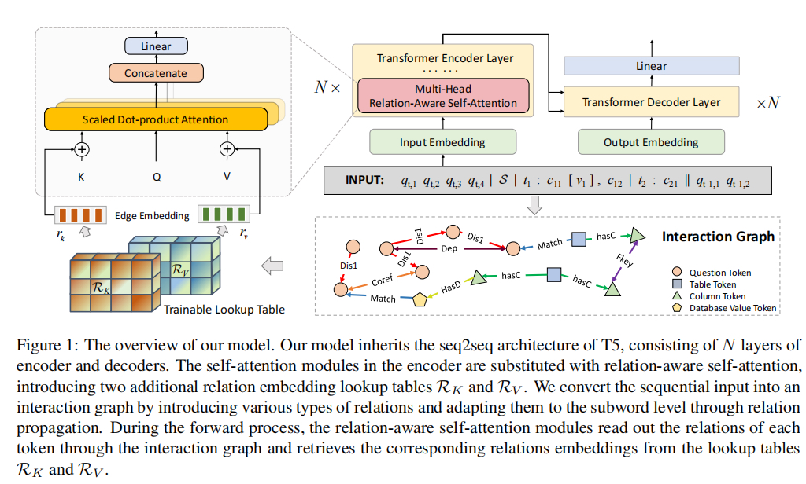

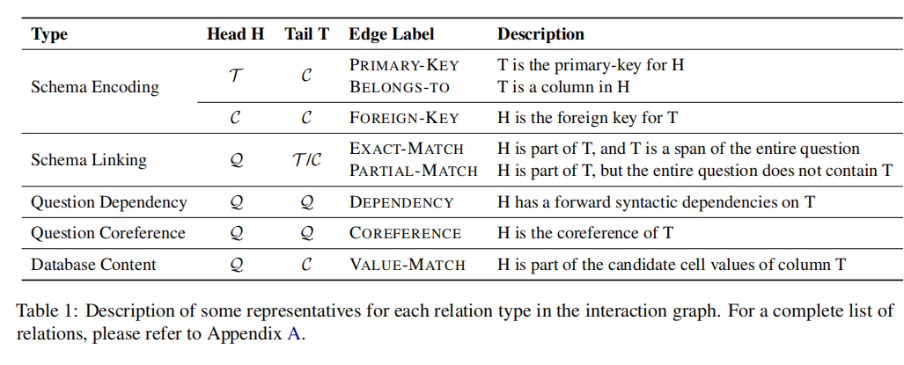

T5模型作为基础模型，将它编码器中的自注意力模块替换为关系感知自注意力。

编码器中的输入融合了问题列表$\mathcal{Q}$，数据库模式$\mathcal{S = \langle T, C \rangle}$，提到的数据库内容和必要的分隔符。

我们主要使用[Shaw et al. (2021)](./papers/NQG-T5.pdf)和[PICARD-Scholak (2021)](./papers/PICARD.pdf)来序列化输入,格式为:
$$
X = \mathcal{Q|S|}t_1:c_{11}[v], ..., c_{1|T_1|}|t_2:c_{21},...
$$
其中$\mathcal{S}$是数据库名，$t_i$是表名，$c_{ij}$是第$i$个表的第$j$列，$v \in \mathcal{V}$表示$c_{11}$之后是数据库内容（将问题的token与内容做```n-gram```匹配)，```|```是$\mathcal{Q, S}$和不同表的分割符号。在每个表中，我们使用```:```来分割表名和它的列，每一列中逗号```,```做为分割符。

在多轮场景中，我们将历史问题添加到句子后面，在T5模型允许的序列长度内容连接起来：
$$
X = \mathcal{Q|S|}t_1:c_{11}[v], ..., ||\mathcal{Q_{t-1}| Q_{t-2}}|...
$$
```||```和```|```是对应的分隔符。

然后将各种类型的标记添加为三元组, 在序列化输入的的标记之间进行链接，自然成了图。它的头和尾对应一个单词或者短语，然而T5是一个字词(subword)级别模型，我们还需要将关系隐射到字词级别。

为了微调，直接继承T5所有的模型参数以及随机初始化由关系感知自注意力引入的额外关系嵌入。

#### 4.2 交互图(Interaction Graph)

为了实现关系感知自注意力，我们将关系信息融入T5模型，只要它能表示为三元组。
它的头（head)和尾（tail）在输入序列$X$中的，格式：
$$
<H, r, T>
$$

给定一个长度为$|X|$输入序列的$X$, 其中一个输入对token，每个方向只存在一条关系。
我们将$X$中的token作为图的顶点（vertices），最多有$|X|^2$条边，每条边对应于图的邻接矩阵中的一个条目。包含整个输入序列token作为定点，融合关系作为边，定义为*交互图( interaction graph)*

对于每种类型的引入关系，分配两个关系嵌入(relation embedding)。Transformer编码器从存储了关系嵌入的可训练查找表中计算key和value，来用在自注意力中。
定义它们为$\mathcal{R}_K, \mathcal{R}_V \in \mathbb R^{u \times d_{kv}}$, 其中$u$是关系种类数，$d_{kv}$是每个注意力头在key和value状态下的维度。

注意：在不同头和层之间共享了关系嵌入，但是key与value的关系分开了。

在前向运算中，在等式1中所有层的$r_{ij}^K$和$r_{ij}^V$在两个可训练的查找表中恢复。

我们保留了一组通用关系，作为没有特定边的token对的模拟关系。最终有50中关系。除了模拟通用关系，大概有5类关系： *schema encoding, schema linking, question dependency structure,
coreference between questions, and database content mentions*

下面描述：

**Schema Encoding** 模式项之间的关系，例如： $H,T \in S$，这个关系描述了一个数据库结构的结构信息。例如：表的主键，列属于哪个表，表的外键等。

**Schema Linking** 模式和问题项之间的关系，例如，$H \in S, T \in Q$，我们使用了[PAT-SQL](./papers/PAT-SQL.pdf)的设定，在问题和模式项之间使用```n-gram```匹配, 识别这个关系很困难，因此我们还区分完全匹配和部分匹配，以一直不完全匹配引起的噪音。

**Question Dependency Structure** 问题依赖树的边，$H, T\in \mathcal{Q}$，这个少有探索，因为它反应的是问题的语法结构。在我们工作中，它控制关系总数，避免不必要的过拟合。我们不区分 不同的依赖关系。

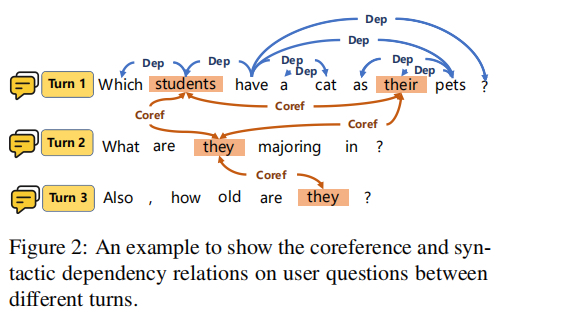

**Coreference Between Questions.**

多轮场景中唯一，如图2, 每轮中，$H \in \mathcal{Q_i}, T \in \mathcal{Q_j}$，尽管T5的预训练模型应该能隐式处理这种关系，但我我们显示添加后效果显著(T5不够大？)

**Database Content Mentions.**

用户可以提及具体列的值，这种场景下，提到的信息可能从上述的```Schema Linking```中逃脱，我们使用了与[BRIDGE](./papers/BRIDGE-v2.pdf)相同的程序来捕获数据库提到的信息。先在数据中的列的值与问题token进行字符串模糊匹配，$H \in \mathcal{Q}, T \ in \mathcal{V}$，然后匹配的值被插入到对应的列名后面。这在很多基于图的模型中广泛使用。

#### 4.3 关系传播（Relation Propagation）

前面提到的各种类型的关系都是在项目（iterm）类型之间，$H, T$要么是单词，要么是短语。
尽管所有的预训练模型是用子词级别的token作为输入，但是输入token和关系之间语法上仍有不同。
之前的工作使用一个额外的步骤去汇聚多个字词来确保交互图中的每个项能得到单个嵌入(single embedding)，例如：mean pooling, attentive pooling，或者BiLSTM(PAT-SQL)。
然后这些汇聚方法不利于在继承预训练模型中的知识。

我们通过创建在$H$和$T$的token的相同类型的关系中创建一个全连接将关系传播到字词级别(subword level)，

### 5 实验

数据集：Spider，SparC和CoSQL。还做了消融实验研究不同模型大小和不同的关系的影响。

#### 5.1 实验设置

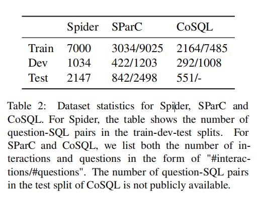

**数据集和评估指标** Spider是大规模，多领域和跨库数据集。SparC和CoSQL是多轮版本的Spider.
我们使用```Exact Match accuracy (EM)```和```EXecution accuracy (EX)```。
在SparC和CoSQL中，引入多轮场景，EM和EX在问题级别和交互级别测量，因此在这两个数据集我们有四个评测指标，命名为：

- Question-level Exact Match (QEM)
- Interaction-level Exact Match (IEM)
- question-level EXecution accuracy (QEX)
- interaction-level EXecution accuracy (IEX)

**实现** 代码基于Hugging-face transformer,  工指消解(coreference resolution)使用https://github.com/msg-systems/coreferee，总共使用51种关系。依赖解析使用([paper-2020](https://aclanthology.org/2020.acl-demos.14/), [Usage doc](https://stanfordnlp.github.io/stanza/index.html))，为了公平比较，对齐了[NQG-T5](./papers/NQG-T5.pdf)大部分的超参数配置，其实现代码在[github](https://github.com/google-research/language/tree/master/language/compgen/nqg)。

#### 5.2 SparC上的结果


四个指标上取得最好成绩，

对比上一个SOTA HIESQL + GraPPa([HIESQL, 蚂蚁, Zheng et al., 2020](./papers/HIE-SQL.pdf))，我们 RASAT + PICARD QEM从64.7%到66.7%，IEM从45.0%到47.2%，我们的SQL能生成带有值的预测SQL，然而表中的很多模型不会预测值。

#### 5.3 CoSQL上的结果


CoSQL比SparC更逼真，更有挑战，我们的模型在3项上达到了SOTA。
在带有值的预测中，我们达到了SOTA，特别是IEX，从26.2%提高到了37.5%。

#### 5.4 Spider上的结果


在Ex中达到了SOTA（80.5%）

#### 5.5 消融实验

均在dev数据集进行。

**SQL难度的影响**


我们猜测，引入关系对于更难的SQL作用更明显，因为简单SQL T5模型已经处理得很好了。
实验表名也是如此（越难的SQL，提升越明显）

**模型大小的影响**
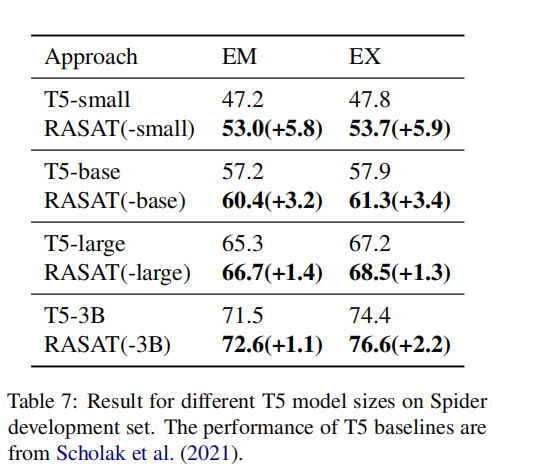

越大的模型效果越好，因为越大的模型能隐式学习到的关系信息更多。

**关系类型**
引入额外实验分析不同关系类型的影响。
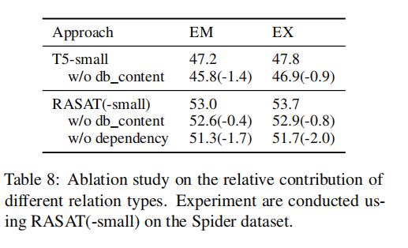
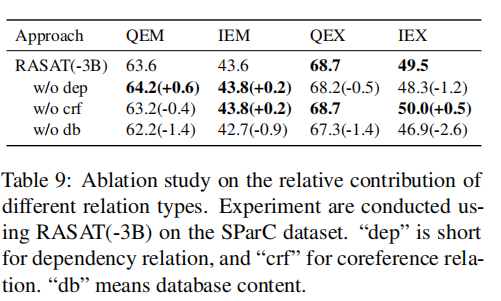

我们发现T5和PASAT都能从数据库内容中提升。另外给PASAT添加依赖关系后效果明显。
在SparC，比较明显的，移除数据库内容后，IEX下降了2.6。

#### 5.6 案例研究

通过两个案例说明引入关系后如何能提升模型的预测精度。

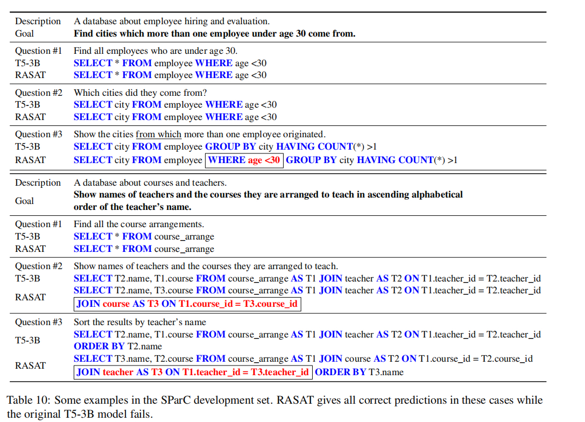

## 名词解释

- <span id="prompt_tuning">提示学习(prompt tuning)</span>
能够通过在输入中添加一个提示词（Prompt），使得预训练模型的性能大幅提高。Prompt Tuning和Fine Tuning都是对预训练模型进行微调的方法。
