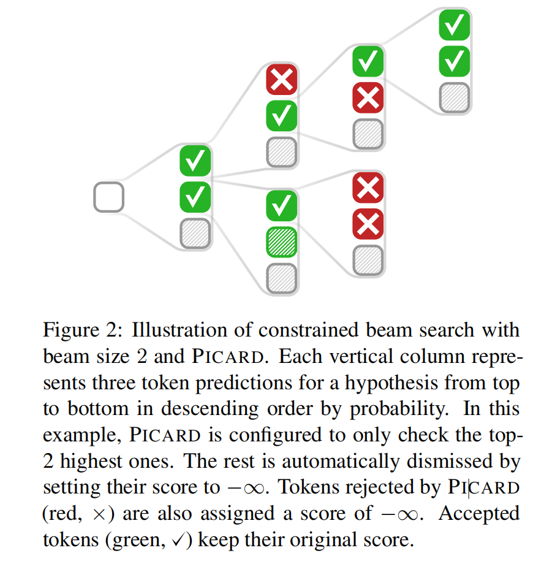
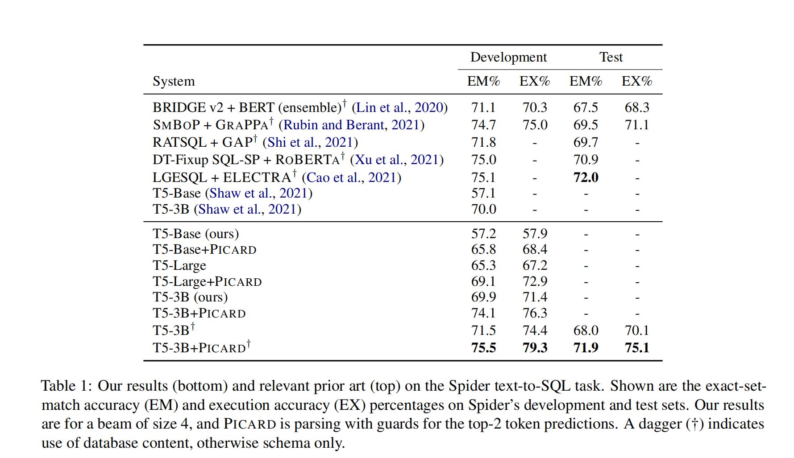
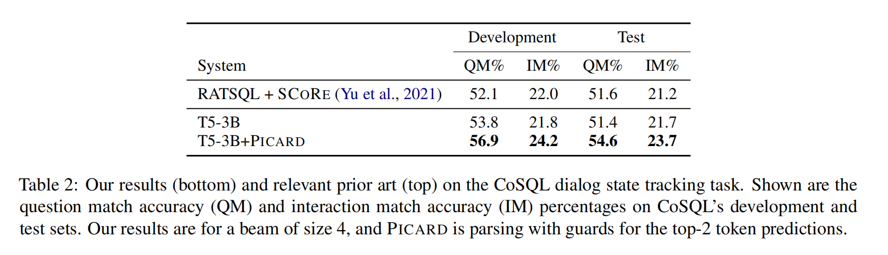
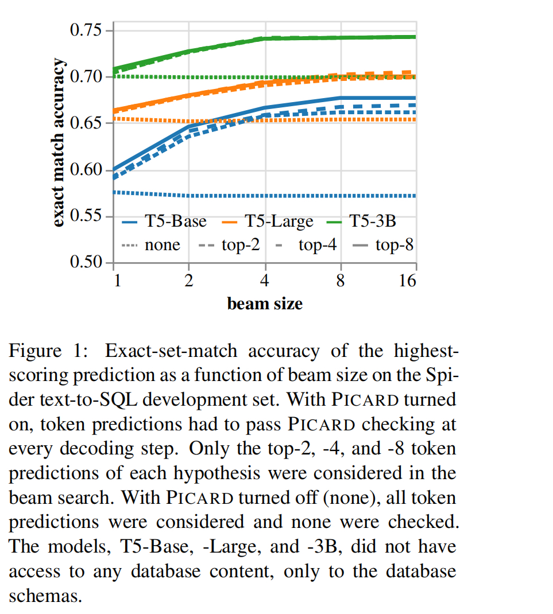
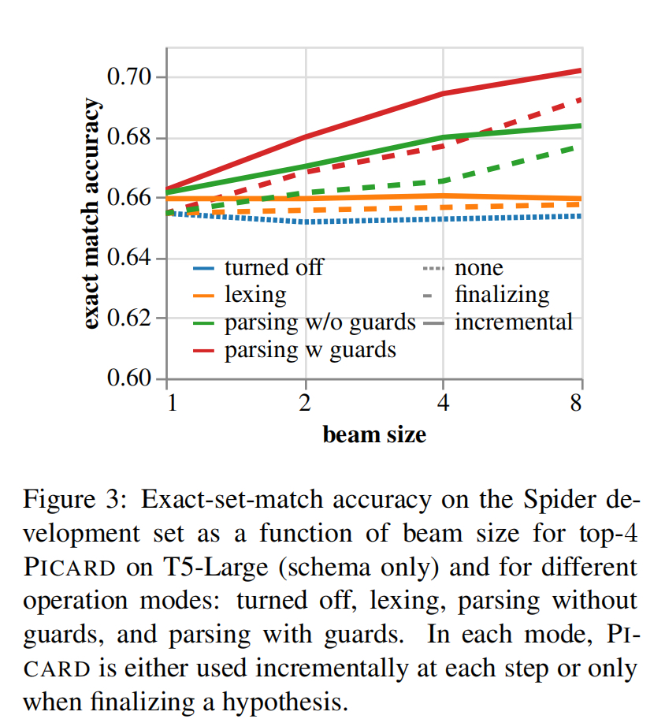

# PICARD: Parsing Incrementally for Constrained Auto-Regressive Decoding from Language Models

PICARD(**P**arsing **I**ncrementally for **C**onstrained **A**uto**R**egressive **D**ecoding)

## Pass1

### abstract

大的预训练语言模型会产生很多输出，但是对于一些任务而言，这些不受约束的输出是没有意义的。
我们提出PICARD, 它通用在解码时约束语言模型的输出来提升任务性能。

### Conclusion

PICARD不仅能在大的语言模型上微调大幅提升性能，还能直接不修改T5模型就能提升性能。

## Pass2

### 1 Introduction

PICARD与现存所有自回归语言模型编码器和词典表都兼容。

**PICARD可以完全不参与模型的预训练或者微调，可以在推理阶段简单或者可选地开启。**

PICARD的操作直接作用在语言模型的输出上，是一种text-to-SQL的翻译场景。

T5-Base + PICARD可以比T5-Large做的更好。
T5-3B + PICARD能在Spider和CoSQL上达到SOTA。

### 2 PICARD方法

PICARD能包装模型的预测分数，能与现有贪心或者束搜索算法轻松集成，用于从语言模型进行自回归解码。

它的参数是Token id、当前假设(hypothesis)、每个词典token(vocabulary token)和 log-softmax预测分数。

PICARD也能处理表结构信息。

在每一步骤，PICARD先预测前k个高概率token，如果失败则给一个正无穷分。



这些检查通过快速增量解析实现。

四种设置：

- off (no checking)
- lexing(句法)
- parsing without guards
- parsing with guards（最高模式）

能通过最高模式预测一定能通过更低模式约，相反这不一定。

#### 2.1 Lexing（句法）

检查句法级别，部分覆盖，解码模型输出为一个空格分割的由独立SQL关键字组成的句子。
对这些词汇项出现的顺序不敏感。

PICARD能识别关键字中的拼写错误，并丢弃对于SQL结构不合法的表名和列名。

例子(来自spider中[dog_kennels](../../data/nlp/spider/spider/database/dog_kennels/schema.sql)库）：

问题："What are the email, cell phone and home phone of each professional?"
微调的T5-Large模型输出:
```select email_address, cell_phone, home_phone from professionals```

实际上```cell_phone```这列不存在，我们的模型能在句法级别避免这个问题，使用表结构中存在的```cell_number```替换它。

#### 2.2 无守卫解析(Parsing without Guards)

在语法基本检查。

PICARD 尝试将去标记化模型输出解析为表示预测SQL查询的抽象语法树 (AST) 的数据结构。
不同于Lexing，关键字和子句的顺序很重。PICARD会丢弃错误的查询结构，例如：缺少“from”关键字，错误的子句和关键字顺序。

它还可以检测 SQL 表达式组合的一系列问题：

1. 如果匹配了"tid.cid", 但是表id “tid”对应的表中没有列名为"cid", 将会被丢弃。
2. 如果第一次匹配了"alias.cid", 然后匹配了"tid as alias"，但是tid没有包含了"cid"，也同样被丢弃（有点像启发式的规则了）

对于绑定到表别名的子查询，也存在等效规则。

最后，PICARD禁止在相同的select作用域重复绑定表别名，但在可以覆盖aliase的地方可以，在嵌套查询中可能出现。

#### 2.3 带守卫的解析（Parsing with Guards）

PICARD进行额外的分析，称为了"called guards", 用与组合SQL AST。

如果匹配"tid.cid"或者"alias.cid"，然后守卫需要表名"tid"或者别名"alias"，分别地，被添加到“from”语句中。接下来: 别名"alias"需要解析为一个表或者一个子查询（其列包含"tid")。

如果 PICARD 在模式 cid 上匹配，则另一个守卫要求最终将确切的一个表带入包含具有该 id 的列的范围内。

这些守卫被急切地强制执行，以便快速失败并尽早从束搜索中弹出无效假设。第一次发生在"from"语句后。

#### 3 实验

Spider和CoSQL都使用zero-shot配置。

Spider采用三个指标：

- Exact-set-match(ESM)：这种比较对文字查询值不敏感，并且可以在语义保留SQL查询重写下减少比较。
- Execution accuracy(EX): 直接对比SQL查询的内容。
- Test-suite execution accuracy
  
这些实例的内容经过优化，以减少误报的数量并提供语义准确性的最佳近似值。

CoSQL中从问题匹配精度（question match accuracy）和交互匹配精度(interaction match accuracy）的角度评估。
两个指标都基于“interaction match accuracy”， 交互匹配精度还关联了一个交互中所有问题的精度。

使用T5作为所有实验的基准。

为了提高未见过数据库的泛化性，我们将表结构和问题编码到输入中。

探测和添加数据内容到列名后（与[BRIDGE](./papers/BRIDGE-v2.pdf)相似)。

为了微调对话状态跟踪任务，在交互中，我们按照输入中出现时间顺序逆序添加问题。

T5输入被限制到512个token。

目标是来自 Spider 和/或 CoSQL 训练集的 SQL，除了将关键字和标识符转换为小写外，未修改。
微调T5，使用Adafactor跑了3072个epoch，批量大小为2048，学习率为$10^{-4}$

**结果**


复现的T5-3B的模型有12%在spider的dev执行报错。同样的模型加了PICARD后，提升明显。首先，错误SQL变少（2%），其次，达到了SOTA。


在CoSQL中达到了SOTA。

不仅提升了性能，还更快。
在T5-3B模型的评估中，束约束长度为4，NVIDIA A100-SXM4-40GB，GPU，不用PICARD每条2.5样本，使用后每条3.1样本。

**束大小(Beam Size)**


增加beam size能提升性能，从1到2提升非常明显。即使是1，PICARD也有不错的提升。

**消融实验**

