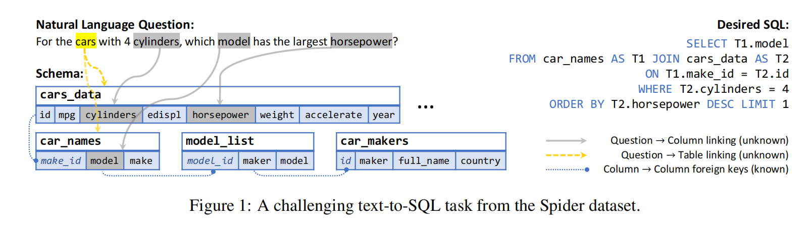
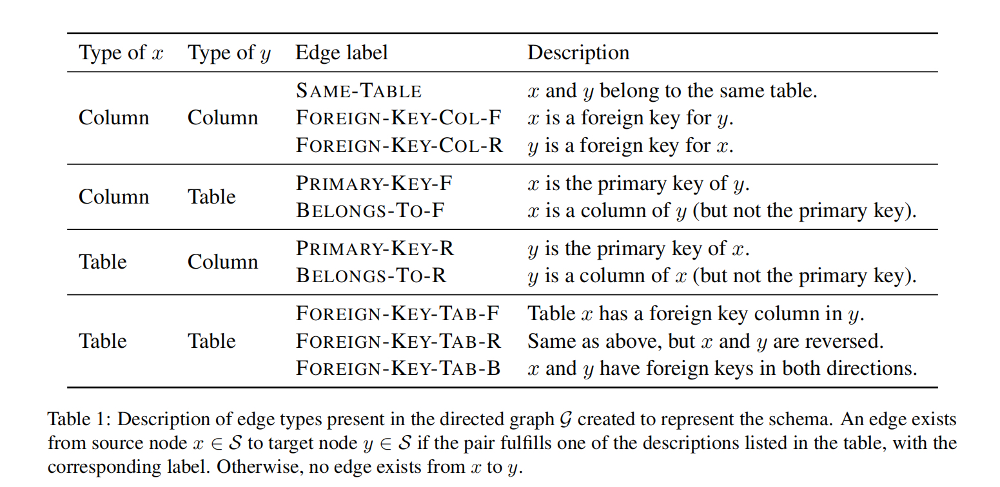
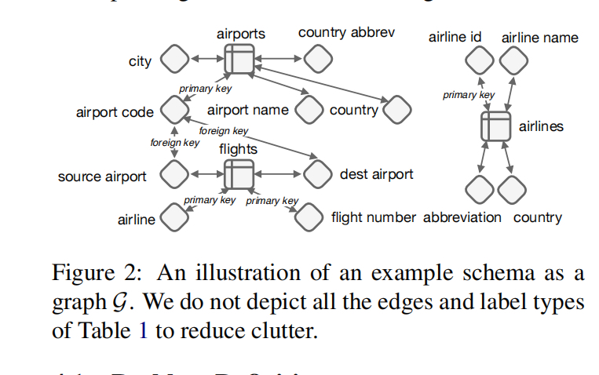

# RAT-SQL: Relation-Aware Schema Encoding and Linking for Text-to-SQL Parsers（对于text-to-SQL解析器的关系感知模式编码和模式链接）

[官方代码](https://github.com/Microsoft/rat-sql)

## Pass1

### abstract

当前模型的挑战是未见过数据库模式的泛化能力。

广义的挑战在于: (a) 在语义解析器中使用一种易实现的方式对数据库关系进行编码。(b)协调恰当建模数据库的列以及他们在问题中提到的信息。

我们提出一个通用框架，基于关系感知自注意力机制(relation-aware self-attention)，在一个text-to-SQL的编码器中解决模式编码（schema encoding）模式链接（schema linking)和特征表示。

Spider数据集的```EM(exact match accuracy)```达到57.2，加上BERT后，达到了SOTA(65.6%)。

### 结论

当前很多模型都努力根据给定的数据模式种学习一种好的表示，以及正确连接列和表在问题中的引用。

本模型在一个相同的编码器架构中组合预定义的硬模式关系(hard schema relations)和推测出软自注意力关系(soft self-attended relations)。

## Pass2

### 1 Introduction

模式泛化困难的三个原因：

1. 任何解析器模型都需要将模式编码到适合解码到SQL查询的表示，该SQL查询可能涉及给定的列或表
2. 这些表示应该编码所有的信息，例如列类型，外键和数据库关联使用的主键。
3. 模型必须要识别自然语言，以便于检索列和表，和可能训练中看到的参考语言不同。
4. 之后的挑战称为模式链接(schema linking)： 将问题中的实体引用与预期的模式列或表对齐。

图1显示了模棱两可的链接。为了正确处理列/表的引用，语法解析器需要考虑到模式关系（schema relations）和问题上下文。



之前的工作[2019-GNN](papers/2019-GNN-SQL.pdf) 通过将模式中的外键编码为有向图。
该工作有两个缺点：
1. 没有使用问题来语境化关系编码

2. 使用外键关系预定义的图限制了信息的传播

我们在模式编码和模式链接中都应用了RAT-SAL。

### 2 Related work

[2019-IRNet](./papers/2019-IRNet.pdf)使用LSTM和自注意力分别编码问题和模式，它进一步使用基于AST的解码器（[2017](./papers/2017-CodeGeneration.pdf)将查询解码为比SQL更高一层的抽象: 中间表示(IR)。[2019-GNN-SQL](./papers/2019-GNN-SQL.pdf)使用GNN和类似的基于语法的解码器。

这两者都强调模式编码和模式链接，但是却设计单独的特征化技术来增强词向量(*word vector*)(而不是词和列之间的关系)。

RAT-SAL框架提供统一的方式来编码输入信息中的任意的关系。

[2019b-GlobalGNN](./papers/2019b-Global-GNN.pdf)在问题和表、列的关系应用全局信息，与RAT-SAL有两个不同：

1. 问题词的表示影响模式的表示，但是反之却不然

2. 与其他基于GNN的编码器一样，消息的传播仅限于模式诱导的边缘，例如外键关系。

RAT-SQL的关系感知transformer机制能编码在问题词和模式元素间的任意关系，这些表示通过在输入中使用自注意力来计算加入。

使用的方法和[2018](./papers/Self-Attention%20with%20Relative%20Position%20Representations.pdf)相同。
第一次应用关系感知自注意力到输入结构中带有预定义的和软诱导关系的联合表示学习。

### 3. Relation-Aware Self-Attention

关系感知自注意力，
一种用来编码半结构化输入序列的模型，使用相同的编码联合编码两种关系：

1. 输入中已经存在的关系结构

2. 输入序列元素中诱导的"软"关系

输入序列$X = \{ \pmb {x_i}_{i = 1}^n\}$, 其中$\pmb {x_i} \in \mathbb R^{x_x}$， 通常情况下，考虑无序集合，$x_i$加入位置编码(positional embedding)来明确地加入顺序关系。

自注意编码器或者说transformer是一系列自注意层的堆叠, 每层由H个头组成，将每个$\pmb{x}_i$转换为$\pmb{y}_i \in \mathbb R^{d_x}$
$$
e_{ij}^{(h)} = \frac{\pmb x_i W_Q^{(h)}(\pmb x_jW_K^{(h)})^T}{\sqrt{d_z/H}} \\
\alpha_{ij}^{(h)} = \text{softmax}_j\{e_{ij}^{(h)}\} \\
\pmb z_i^{(h)} = \sum_{j = 1}^n \alpha_{ij}^{(h)}(\pmb x_j W_V^{h}) \\
\pmb z_i^{(h)} = \text{Concat}(z_i^{(1)}, ..., z_i^{(H)}) \\
\hat{\pmb y_i} = \text{LayerNorm}(\pmb x_i + \pmb z_i) \\
\pmb y_i = \text{LayerNorm}(\hat{\pmb y_i} + \text{FC}(\text{ReLU}(\text{FC}(\hat{\pmb y_i})))) \tag 1
$$
其中，$1 <= h <= H$，$W_Q^{h}, W_K^{(h)}, W_V^{(h)} \in \mathbb R^{d_x \times (d_x / H)}$

有一种解释：transformer编码能在所有输入中学习关系。
然而，在输入中的一些已经存在的关系特征会导致我们的编码器模型偏移。然后限制注意力计算在"硬"边种（已知已存在关系），类似于图注意力网络(Graph attention entwork)。

RAT-SQL提供了一种方式传递关系到编码器中（通过添加表示到注意力机制中）。
[Shaw et al. 2018](./papers/Self-Attention%20with%20Relative%20Position%20Representations.pdf) 修改等式添加了相对位置信息:

$$
e_{ij}^{(h)} = \frac{\pmb x_i W_Q^{(h)}(\pmb x_jW_K^{(h)} + r_{ij}^K)^T}{\sqrt{d_z/H}} \\
\pmb z_i^{(h)} = \sum_{j = 1}^n \alpha_{ij}^{(h)}(\pmb x_j W_V^{h} + r_{ij}^V) \tag 2
$$

这里的$r_{ij}$称为输入的两个元素$x_i$和$x_j$中的已知关系的编码, 在[Shaw et al. 2018](./papers/Self-Attention%20with%20Relative%20Position%20Representations.pdf) 仅仅作为相对位置表示。

考虑$R$个关系特征，每个是一个二元关系$\mathcal{R}^{s} \subseteq X \times X (1 <= s <= R$, RAT-SQL框架表示所有已存在的特征边$(i, j)$为 $\pmb{r_{ij}^{K}} = \pmb {r_{ij}^V} = \text{Concat}(\pmb{\rho_{ij}^{(1)}}, ... , \pmb {\rho_{ij}^{(R)}})$，其中每个$\pmb{\rho_{ij}^{(s)}}$要么是对于关系$\mathcal R^{(s)}$的*学习编码(learning embedding)*，如果关系中保存了相应的边(例如: $(i, j) \in \mathcal R^{(s)}$)，要么是$0$向量。

### 4 RAT-SQL

#### 4.1 Problem Definition

给定一个自然语言的问题$Q$ 和一个关系型数据库的模式$\mathcal S = \langle \mathcal C, \mathcal T \rangle$，我们的目标是生成对应的SQL表示 $P$， 问题$Q = q_1 ... q_{|Q|}$ 是词序列，模式由列 $\mathcal C = \{ c_1, ..., c_{|\mathcal{C}|} \}$和表$\mathcal T = {t_1, ..., t_{|\mathcal{T}|}}$组成。每个列名$c_i$包含单词$c_{i, 1}, ..., c_{i, |c_i|}$, 每个表名$t_i$包含单词$t_{i, 1}, ..., t_{i, |t_i|}$。$P$ 表示为SQL中的上下文无关的抽象语法树 $T$。

每一列都有一个类型$\tau \in \{\text{number}, \text{text}\}$。

表示数据库模式为有向图$\mathcal G = \langle \mathcal V, \mathcal E \rangle$，它的顶点$\mathcal V = \mathcal C \cup \mathcal T$，是列和表中的模式，每个都用它名称中的单词打标（对于列，我们在标签前添加它的类型 $\tau$），它的边$\mathcal E$通过数据库中存在的关系定义，见[表1](#table1)，[图2](#figure2)是样例图示


<div id="table1"/>



<div id="figure2"/>

$\mathcal G$中保存了模式中所有已知关系信息，它不足以正确编码在问题$Q$中的上下文中出现的但是之前没有见过的模式。
我们想将模式$\mathcal S$和问题$Q$联合，尤其是对协调两者的建模。因此，我们定义了*问题上下文模式图(question contextualized schema graph)* $\mathcal G_Q = \langle \mathcal V_Q, \mathcal E_Q \rangle$，这里的$\mathcal V_Q = \mathcal V  \cup Q = \mathcal C  \cup \mathcal T \cup Q$ 包含了查询词的节点（使用相应词打标），$\mathcal E_Q = \mathcal E \cup \mathcal E_{Q \leftrightarrow S}$是模式边$\mathcal E$扩展了问题词和模式成员的特殊关系。

RAT-SQL使用*编码器解码器框架*，给定一个输入图$\mathcal G_Q$，编码器$f_{\text{enc}}$ 对于每列$c_i \in \mathcal C$，表$t_i \in \mathcal T$和问题词 $q \in Q$ 编码为联合表示$\pmb c_i, \pmb t_i, \pmb q_i$。
编码器$f_{\text{dec}}$计算一个分布$Pr(P | \mathcal G_Q)$。

#### 4.2 Relation-Aware Input Encoding

我们的编码器首先获得$\mathcal G$中每个节点的初始表示$\pmb c_i^{\text{init}}$, $\pmb t_i^{\text{init}}$, 通过一下方法: (a) 通过预训练的GloVe模式对每个词做词嵌入，(b) 对每个多词(mutlti-word)标号使用**Bi-LSTM**。也在问题中执行一个独立的*Bi-LSTM*来获得初始的词表示$\pmb q_i^{\text{init}}$。

输入$X$:
$$
X = (\pmb c_1^{\text{init}}, ..., \pmb c_{|\mathcal C|}^{\text{init}}, \pmb t_1^{\text{init}}, ..., t_{|\mathcal T|}^{\text{init}}, \pmb q_1^{\text{init}}, ..., \pmb q_{|Q|}^{\text{init}})
$$

编码器$f_{\text{enc}}$应用N个关系感知自注意力层到输入$X$中，每层使用独立的权重矩阵，最终表示$\pmb c_i, \pmb t_i, \pmb q_i$是第$N$层的输出。

此外，我们也使用了BERT编码来获得初始表示。我们将输入X喂给BERT，使用它最后的隐藏层，作为RAT层的初始表示。

#### 4.3 Schema Linking

$\mathcal E_{\leftrightarrow}Q$中的模式链接关系用来对齐问题中对应的列和表的引用。

这种对齐由两种类型的信息隐式定义：*匹配名(matching names)*和*匹配值(matching values)*。

**Name-Based Linking** 基于名称的链接是列/表中的名称精确或部分出现在问题中。文本匹配是问题-模式对齐最直接的证据。然而，根据我们实验，vanilla self-attention产生的表示对文本匹配不敏感，即便他们最初的表示是相同的。为了解决这个现象，我们使用RAT relations直接编码基于名称的链接。

特别地，对于问题中所有的长度为1-5的n-gram，我们定义(1) 是否精确匹配列/表的名称(*exact match*); (2) n-gram是列/表名的字序列（*partial math*）。
然后，对于所有的$(i, j)$，这里的$x_i \in Q, x_j \in S$(反之亦然)，我们设置$r_{ij} \in \mathcal E_{Q \leftrightarrow S}$为 **Q**UESTION-**C**OLUMN-**M**, **Q**UESTION-**T**ABLE-**M**, **C**OLUMN-**Q**UESTION-**M**或者**T**ABLE-**Q**UESTION-**M**, 取决于$x_i$和$x_j$的类型。这里的M是**E**XACT**M**ATCH, **P**ARTIAL**M**ATCH或**N**O**M**ATCH。

**Value-Based Linking** 

隐私政策和速度影响使得端到端的模型非常有挑战。

我们添加了一种新的关系"COLUMN-VALUE"在查询词$q_i$和列名$c_j$间。$q_j$是列$c_j$的一个值或者值中的完整单词。
这个简单的方法极大提升了RAT-SQL的性能。直接解决了上述提到的数据库的挑战：

1. 模型不会暴露给其他在数据库中单未在问题中出现的内容

2. 词匹配非常快（通过数据库索引或者文本搜索）

**Memory-Schema Alignment Matrix** 直觉告诉我们SQL $P$中出现的列名或表名与其在问题中对应的引用有关系。 为了在模型中捕获这种关系，我们在$y$的内存单元和所有的表列中应用关系感知自注意力显式计算对齐矩阵$L^{\text{col}} \in \mathbb R^{|y| \times |\mathcal{C}|}$ 和$L^{\text{tab}} = \mathbb R^{|y| \times |\mathcal{T}|}$:
$$
\hat{L}_{ij}^{\text{col}} = \frac{y_i W_Q^{\text{col}} (c_j^{\text{final}} W_K^{\text{col}} + \pmb r_{ij}^K)^T}{\sqrt{d_x}} \\
\hat{L}_{ij}^{\text{tab}} = \frac{y_i W_Q^{\text{tab}} (c_j^{\text{final}} W_K^{\text{tab}} + \pmb r_{ij}^K)^T}{\sqrt{d_x}} \\
L_{i,j}^{\text{col}} = \text{softmax}_j\{\hat{L}_{i, j}^{\text{col}}\} \\
L_{i,j}^{\text{tab}} = \text{softmax}_j\{\hat{L}_{i, j}^{\text{tab}}\} \tag 3
$$

直觉上，等式3与稀疏平面相似，因此应该重视某些约束，例如稀疏性。稀疏性趋势学习，也通过明确的目标函数来鼓励学习。

#### 4.4 Decoder

解码器是与论文[Yin and Neubig (2017)](./papers/2017-CodeGeneration.pdf)一样的树形架构，以深度优先遍历的顺序生成SQL $P$的抽象语法树，使用LSTM输出 *解码器行为 (decoder actions)* 的序列, 其中解码器行为: （1）展开上一个生成的节点为语法规则，称为*APPLYRULE*；或者完成一个叶子节点，（2）从schema中选择一个列或表，称为SelectColumn 和SelectTable。

正式地、$Pr(P | \mathcal{Y}) = \prod_t Pr(a_t | a_{<t}, \mathcal{Y})$, 其中$ \mathcal{Y} = f_{\text{enc}}(\mathcal{G}_Q)$ 是问题(question)和schema的最终编码，$a_{<T}$ 是之前的action。
在树形结构（tree-structure）编码器中，$LSTM$的状态更新方式: $\pmb m_t, \pmb h_t = f_{\text{LSTM}}([a_{t-1} || z_t || \pmb h_{p_t} || \pmb a_{p_t} || n_{f_t}], \pmb m_{t-1}, \pmb h_{t - 1})$, 其中$\pmb m_t$是LSTM  cell 状态，$\pmb h_t$是LSTM在第$t$步的输出, $a_{t-1}$是之前action的编码。