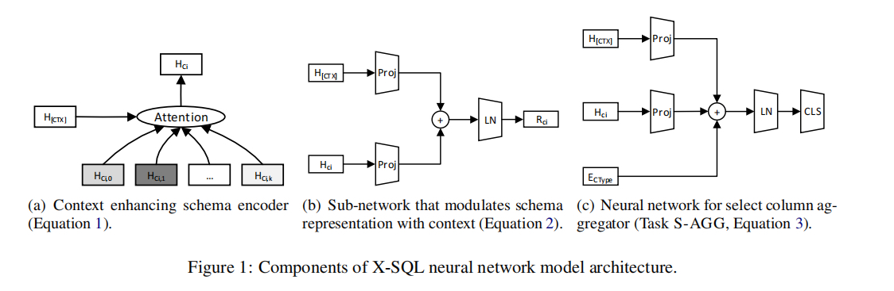

# X-SQL(2019-Microsoft)

## Pass1

### 摘要

解决文本语言生成SQL查询语句的新的网络架构。
通过bert预训练模型的输出的上下文表示, 并且结合了类型信息来学习下游任务的新的模式表示。在WikiSQL 数据集取得了SOTA性能。

### 结论

受限于WikiSQL使用的特定SQL语法，后续在更复杂的数据集[Spider](https://yale-lily.github.io/spider)中探索。

### 试验和方法图标

对比了不同的模型（SQLova、SQLNet、X-SQL)在不同子任务上的性能，X-SQL性能突出。

### 相关数据集

#### WikiSQL

[WikiSQL](https://github.com/salesforce/WikiSQL)

#### Spider

[Spider-github](https://github.com/taoyds/spider)

[Spider-Leaderboards](https://yale-lily.github.io/spider)

[Spider-Huggingface](https://huggingface.co/datasets/spider)

## Pass2

### 1. Introduction

要解决的问题：结构化数据库上的QA问题： 一个将自然语言转为对应含义的SQL语言，在数据库上查询以获得答案的语法解析问题。

之前的工作：

结合Attention和Copy mechanism的seq-to-seq模型

最近关注点已经开始将SQL语法融入到神经网络当中了:

1. 通过不同预测模块之间的依赖关系捕获语法(2017, 2018a)
2. 使用槽填充方法，通过预定义的草图确保句法正确性（2018两篇)

从大量数据集训练的预训练模型有很大价值，在此趋势下提出了X-SQL，三个点：

1. 两种类型的文本信息：a. 非结构化的自然语言查询，b. 结构化的数据模型, 以前的工作要么独立建模它们，要么在它们之间建立交叉注意力

2. 部分的SQL语法与其对应数据类型绑定（只包含数字列>算子不能用于字符串类型等）

3. 之前的方法中直接使用二分类在Where语句中无法很好的建模多列之前的关系（不同分类器独立优化，难以直接比较）

### 2 网络架构

三层架构：

1. Sequence encoder
2. 结构化上下文增强 encoder
3. 输出层

#### 2.1 Sequence Encoder

与BERT类型，但是做了一些修改：

- 特殊的空列[EMPTY], 添加到每个表结构中, 2.4会讲

- 段嵌入(Segment embedding)被类型(Type embedding)嵌入替代, 学习四种类型: question, categorial column, numerical column and the special empty column.

- 不直接使用BERT-Large预训练模型，而是使用MT-DNN(与BERT同架构，但是在[GLUE](https://gluebenchmark.com/tasks)任务中进行训练)

将Bert的```[CLS]```输出改为```[CTX]```输出，这个包含了上下文信息。

#### 2.2 上下文增强模式编码器(Context Enhanced Schema Encoder)

encoder输出:

$$
h_{[CTX]}, h_{q1}, ..., h_{qn}, h_{[SEP]}, h_{C_{11}}, ..., h_{[SEP]}, h_{C_{21}}, ...h_{[SEP]},...,h_{[EMPTY]}, h_{[SEP]}
$$

其中:

- 每一个的维度都是$d$
- $h_{qi}$：问题token
- $h_{C_{ij}}$: 第$i$列的$j$个token的输出(每列可能有多个问题token)

上下文增强编码器的本质:
(图一)尝试通过使用在$h_{[CTX]}$中捕获的全局上下文信息来加强原始编码器输出，来为每一列$i$学习新的表示$h_{C_{i}}$。

第$i$列的token的数量为$n_i$, 模式编码器通过下列公式来汇总每一列:
$$
h_{C_i} = \sum_{t=1}^{n_i} \alpha_{it}h_{C_{it}}
$$

这里的$\alpha_{it} := \text{SOFTMAX}(s_{it})$, 对齐模型$s_{it}$表示第$i$列的第$j$个token与全局上下文信息的匹配程度，定义为:
$$
s_{it} = f(Uh_{[CTX]}/\sqrt{d}, Vh_{C_{it}}/\sqrt{d})
$$

这里的$U,V \in \mathbb{R}^{m \times d}$, 函数$f$简单使用点积。

一些上下文度量信息已经被序列编码器捕获到了，捕获在$h_{[CTX]}$中的全局上下文信息已经足够多样化了，

本文中的上下文增强模式编码器与```Column attention```有些相似，```Column attention```通过哪些问题词汇与某列最相关来更新$h_{qi}$, 不同列独立处理。
上下文增强模式编码器只使用捕获到```[CTX]```中的上下文信息来更新模式，因为```[CTX]```还包含了其它模式的信息，所有每列不再是独立更新。



#### 2.3 输出层

输出层由序列编码器的输出$h_{[CTX]}, h_{q_1}, ..., h_{q_n}$ 和上下文增强模式编码器的输出$h_{C_1}, h_{C_2}, ..., h_{[EMPTY]}$来合成SQL程序。

这个任务会被拆分为6个子任务，每个预测最终SQL程序的一部分。

任务依赖的子网络: 通过使用$h_{CTX}$来调节模式表示$h_{C_i}$, 特别地,
$$
r_{C_i} = \text{LayerNorm}(U^{'}h_{[CTX]} + V^{'}h_{C_i})
$$

与方程1不同，每个子任务的计算是独立完成的，为了更好的调整模式以表示每个子任务应当关注的自然语言问题的特殊部分。

1. 第一个子任务: S-COL(预测```SELECT```语句的列)
列$C_i$被选择的概率建模为:
$$
p^{S-COL}(C_i) = \text{SOFTMAX}(W^{S-COL} r C_i)
$$
其中$W^{S-COL} \in \mathbb{R}^{1 \times d}$, 注意：S-COL只依赖于$r_{C_i}$
2. 第二个子任务: S-AGG(预测SELECT字段的聚合操作)
聚合器（aggregator）依赖于选择列的类型。某些算子，例如MIN不能应用于字符串类型，故直接将类型编码到模型中, 计算:
$$
p^{S-AGG}(A_j|C_i) = \text{SOFTMAX}(W^{S-AGG}[j,:] \times \text{LAYERNORM}(U^{''}h_{[CTX]} + V^{''}h_{C_i}) + E_{C_i} ^ T)
$$
其中$W^{S-AGG} \in \mathbb{R}^{6 \times d}$(6是聚合算子的数量)，Type embedding $E_{C_i}^{T}$分开学习。

其余的子任务: W-NUM, W-COL, W-OP和W-VAL一起决定where的部分。
3. 第三个子任务: W-NUM(预测有多少个where语句)
$$
W^{W-NUM}h_{[CTX]}
$$
这是有四个label(1-4)的分类问题，它不会预测空的where，这被委派给W-COL(其使用KL散度（Kullback-Leibler divergence）, 2.4具体讲)
4. 第四个子任务: W-COL(列上的概率分布)
$$
p^{\text{W-COL}}(C_i) = \text{SOFTMAX}(W^{\text{W-COL}}r_{C_i})
$$

再根据$W-NUM$中的数字，分数高的一些列将被选出来，放到where条件中。
5. 第五个子任务: W-OP(选出Where列中出现概率最大的操作符)
$$
p^{\text{W-OP}}(O_j|C_i) = \text{SOFTMAX}(W^{W-OP}[j,:]r_{C_i})
$$

模型参数$W^{\text{W-NUM}}$, $W^{\text{W-COL}}$, $W^{\text{W-OP}}$的维度分别是： $\pmb R^{4 \times 4}$, $\pmb R^{1 \times d}$和$\pmb R^{3 \times d}$, 其中操作符的个数为3个。
6. 第六个子任务：W-VAL（where条件的值，来自于问题中的一段范围的文本，只需预测开始和结束位置即可）。
$$
p_{\text{start}}^{\text{W-VAL}}(q_j|C_i) = \text{SOFTMAX} \quad g(U^{\text{start}}h_{qj} + V^{\text{start}}r_{C_i})
$$
和
$$
p_{\text{end}}^{\text{W-VAL}}(q_j|C_i) = \text{SOFTMAX} \quad g(U^{\text{end}}h_{qj} + V^{\text{end}}r_{C_i})
$$

这里的$g(x) := Wx + b$, $U^{\text{start}}, V^{\text{start}}, U^{\text{end}}, V^{\text{end}} \in \pmb R^{m \times d}$

#### 2.4 训练和推导

训练期间，对所有独立的子任务损失求和。

其中, S-COL, S-AGG, W-NUM, W-OP和W-VAL使用```cross entropy loss```, 而W-COL定义为$D(Q||P^{\text{W-COL}})之间的$KL散度( Kullback-Leibler divergence)。

## 相关链接

[MT-DNN-zhihu](https://zhuanlan.zhihu.com/p/103220246)
